<h2>TensorFlow-FlexUNet-Image-Segmentation-Mendeley-Kidney-Stone-CT (2026/06/17)</h2>
Sarah T. Arai 
Software Laboratory antillia.com  
This is the first experiment of Image Segmentation for <b>Mendeley-Kidney-Stone-CT</b> based on our <a href="./src/TensorFlowFlexUNet.py">TensorFlowFlexUNet</a> 
(TensorFlow Flexible UNet Image Segmentation Model for Multiclass), 
and a 512x512 pixels PNG Antillia 
<a href="https://drive.google.com/file/d/1FTcG501KbwuYjo1p9ze8LKLKjnWUEYLm/view?usp=sharing">
<b>Augmented-Mendeley-Kidney-Stone-CT-ImageMask-Dataset.zip</b></a> 
(<a href="https://creativecommons.org/licenses/by/4.0/">CC BY 4.0</a>)
, which was derived by us from   
<b>Original/Stone</b> subset of 
<a href="https://data.mendeley.com/datasets/fwhytt5mzd/2">
<b>Axial CT Imaging Dataset for AI-Powered Kidney Stone Detection: A Resource for Deep Learning Research
</b></a>   
For more information of Kidney Stone segmentation, please refer to our experiment 
<a href="https://github.com/sarah-antillia/TensorFlow-FlexUNet-Image-Segmentation-KSSD2025-Kidney-Stone-CT">
TensorFlow-FlexUNet-Image-Segmentation-KSSD2025-Kidney-Stone-CT</a>  

<b>Actual Image Segmentation for Mendeley-Kidney-Stone-CT Images of 512x512 pixels </b> 
As shown below, the inferred masks predicted by our segmentation model trained by the dataset appear similar to the ground truth masks.
However, it is not easy to segment the Stone regions precisely, because those are relatively small. 
  
<table >
<tr>
<th>Input: image</th>
<th>Mask (ground_truth)</th>
<th>Prediction:inferred_mask</th>
</tr>
<tr>
<td>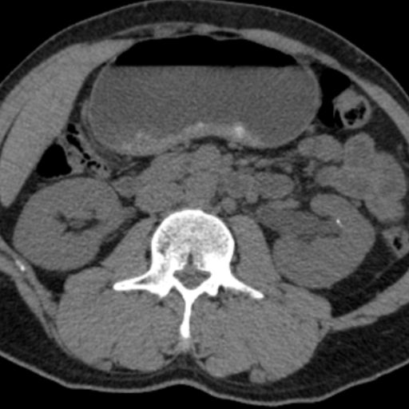</td>
<td></td>
<td></td>
</tr>

<tr>
<td>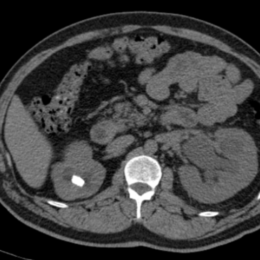</td>
<td></td>
<td></td>
</tr>

<tr>
<td>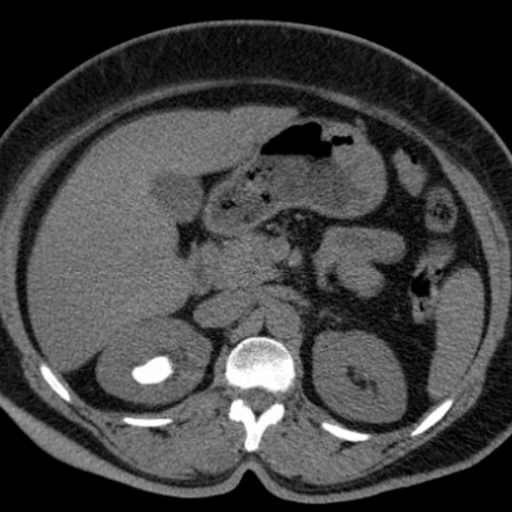</td>
<td>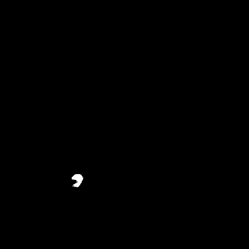</td>
<td></td>
</tr>
 
</table>

 
<h3>1  Dataset Citation</h3>
The dataset used here was derived from   
<b>Original/Stone</b> subset of 
<a href="https://data.mendeley.com/datasets/fwhytt5mzd/2">
<b>Axial CT Imaging Dataset for AI-Powered Kidney Stone Detection: A Resource for Deep Learning Research
</b></a>  
 
The following explanation was taken from the above web site.  
<b>Description</b> 
This dataset introduces a comprehensive CT scan image dataset focused on kidney stone detection, 
consisting of two groups: one from individuals diagnosed with kidney stones and the other 
from those without the condition.  
The dataset has been meticulously curated, verified, and labeled by experienced medical professionals, 
ensuring its high quality and reliability for both research and educational applications.  
Collected from medical centers in Sulaimani and Rania, Kurdistan Region, Iraq, the dataset provides 
unique insights into the prevalence and characteristics of kidney stones in this region.  
With 3,364 original CT images and 35,457 augmented images, it offers a valuable resource for 
developing and evaluating deep learning algorithms for kidney stone detection.  
The augmented images further increase their applicability for algorithm training, medical research, 
and educational purposes. This dataset can potentially advance diagnostic tool development, enhance medical research, 
and serve as an educational resource for students studying kidney stone.
  
<b>Citation</b> 
Abdalla, Peshraw Ahmed; Mahmood, Bander Sidiq; Hama, Nawzad Rasul (2025),  
“Axial CT Imaging Dataset for AI-Powered Kidney Stone Detection:  
A Resource for Deep Learning Research”, Mendeley Data, V2, doi: 10.17632/fwhytt5mzd.2 
 
<b>License</b> 
<a href="https://creativecommons.org/licenses/by/4.0/">CC BY 4.0</a>
 
 
<h3>
2 Mendeley-Kidney-Stone-CT ImageMask Dataset
</h3>
<h3>
2.1 Download ImageMask Dataset
</h3>
 If you would like to train this Mendeley-Kidney-Stone-CT Segmentation model by yourself,
please down load our dataset <a href="https://drive.google.com/file/d/1FTcG501KbwuYjo1p9ze8LKLKjnWUEYLm/view?usp=sharing">
<b>Augmented-Mendeley-Kidney-Stone-CT-ImageMask-Dataset.zip</b> 
</a>(<a href="https://creativecommons.org/licenses/by/4.0/">CC BY 4.0</a>) 
 on the google drive,
expand the downloaded, and put it under <b>./dataset/</b> to be:
<pre>
./dataset
└─Mendeley-Kidney-Stone-CT
    ├─test
    │   ├─images
    │   └─masks
    ├─train
    │   ├─images
    │   └─masks
    └─valid
        ├─images
        └─masks
</pre>
 
<b>Mendeley-Kidney-Stone-CT Statistics</b> 
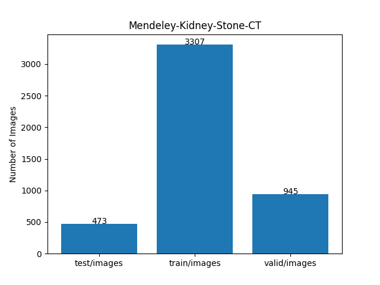 
 
As shown above, the number of images of train and valid datasets is large enough to use for a training set of our segmentation model.
  
<h3>
2.2 Derivation of Mendeley-Kidney-Stone-CT ImageMask Dataset
</h3>
The folder structure of the <b>Original</b> dataset is the following, but it contains no annotation(mask) files,
because it is an image classification dataset. 
<pre>
./Kindey Stone Dataset
└─Origina
    ├─Non-Stone
    │   ├─P001_FA_M_NS_I01.jpg
...
    │   └─P140_RA_F_NS_I28.jpg
    │   
    └─Stone
        ├─P037_FA_M_S_I01.jpg
...
        └─P201_RA_F_S_I12.jpg
</pre>
<b>Step 1</b> 
We generated a 512x512 cropped PNG Stone master dataset from the JPG files in <b>Original/Stone</b> folder.
  
<b>Step 2</b> 
We generated our own mask dataset corresponding to the master image dataset
by applying an inference (segmentation) method of
a pretrained model <a href="https://github.com/sarah-antillia/TensorFlow-FlexUNet-Image-Segmentation-KSSD2025-Kidney-Stone-CT">
TensorFlow-FlexUNet-Image-Segmentation-KSSD2025-Kidney-Stone-CT
</a> to the master images
, without human annotation experts.  
<b>Step 3</b> 
We generated our Augmented ImageMask Dataset from all pair of 512x512 pixels master images and their correspoding 
masks just generated above  
by using the following image deformation tools. 
<a href="https://github.com/sarah-antillia/Image-Deformation-Tool">Image-Deformation-Tool</a> 
<a href="https://github.com/sarah-antillia/Image-Distortion-Tool">Image-Distortion-Tool</a> 
 
<h3>
2.3 Train Sample Images and Masks
</h3>

<b>Train sample images</b> 
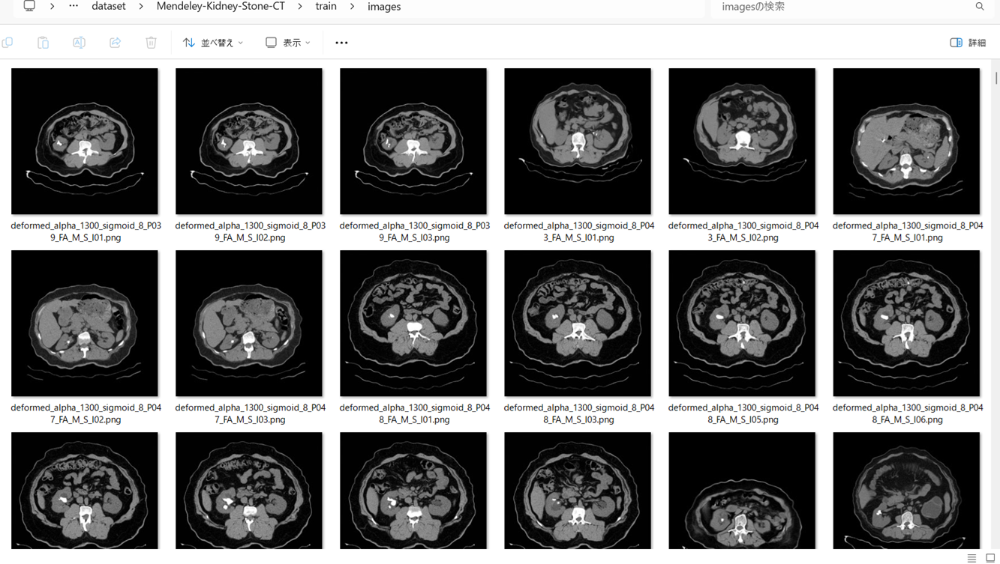
 
<b>Train sample masks</b> 

 
<h3>
3 Train TensorflowFlexUNet Model
</h3>
 We trained Mendeley-Kidney-Stone-CT TensorFlowFlexUNet Model by using the 
<a href="./projects/TensorFlowFlexUNet/Mendeley-Kidney-Stone-CT/train_eval_infer.config"> <b>train_eval_infer.config</b></a> file.  
Please move to ./projects/TensorFlowFlexUNet/Mendeley-Kidney-Stone-CT and run the following bat file. 
<pre>
>1.train.bat
</pre>
, which simply runs the following command. 
<pre>
>python ../../../src/TensorFlowFlexUNetTrainer.py ./train_eval_infer.config
</pre>

<b>Model parameters</b> 
Defined a small <b>base_filters=16</b> and a large <b>base_kernels=(9,9)</b> for the first Conv Layer of Encoder Block of 
<a href="./src/TensorFlowFlexUNet.py">TensorFlowFlexUNet.py</a> 
and a large <b>num_layers=8</b> (including a bridge between Encoder and Decoder Blocks).
<pre>
[model]
image_width    = 512
image_height   = 512
image_channels = 3
input_normalize = True
normalization  = False
num_classes    = 2
base_filters   = 16
base_kernels  = (9,9)
num_layers    = 8
dropout_rate   = 0.05
dilation       = (1,1)
</pre>
<b>Learning rate</b> 
Defined a small learning rate.  
<pre>
[model]
learning_rate  = 0.0001
</pre>
<b>Loss and metrics functions</b> 
Specified "categorical_crossentropy" and "dice_coef_multiclass". 
<pre>
[model]
loss           = "categorical_crossentropy"
metrics        = ["dice_coef_multiclass"]
</pre>
<b >Learning rate reducer callback</b> 
Enabled learing_rate_reducer callback, and a small reducer_patience.
<pre> 
[train]
learning_rate_reducer = True
reducer_factor     = 0.4
reducer_patience   = 4
</pre>
<b>Early stopping callback</b> 
Enabled early stopping callback with patience=10 parameter.
<pre>
[train]
patience      = 10
</pre>
<b>Infer section</b> 
<pre>
[infer] 
images_dir    = "./mini_test/images/"
output_dir    = "./mini_test_output/"
</pre>
<b>RGB color map</b> 
rgb color map dict for Mendeley-Kidney-Stone-CT 1+1 classes. 
<pre>
[mask]
mask_file_format = ".png"
;Mendeley-Kidney-Stone-CT 1+1
rgb_map {(0, 0, 0): 0, (255, 255, 255):1}
</pre>
<b>Epoch change inference callbacks</b> 
Enabled epoch_change_infer callback. 
<pre>
[train]
epoch_change_infer     = True
epoch_change_infer_dir =  "./epoch_change_infer"
epoch_change_infer     = False
epoch_change_infer_dir =  "./epoch_change_infer"
num_infer_images =  6
</pre>
By using this <b>epoch_change_infer</b> callback, on every epoch_change, the <b>infer</b> method of the 
<a href="./src/TensorFlowFlexModel.py">TensorFlowFlexModel</a> class 
can be called
 for 6 images in <b>mini_test</b> folder specified in <b>tiledinfer</b> section. This will help you confirm how the predicted mask changes 
 at each epoch during your training process.    
<b>Epoch_change_inference output at starting (1,2,3)</b> 
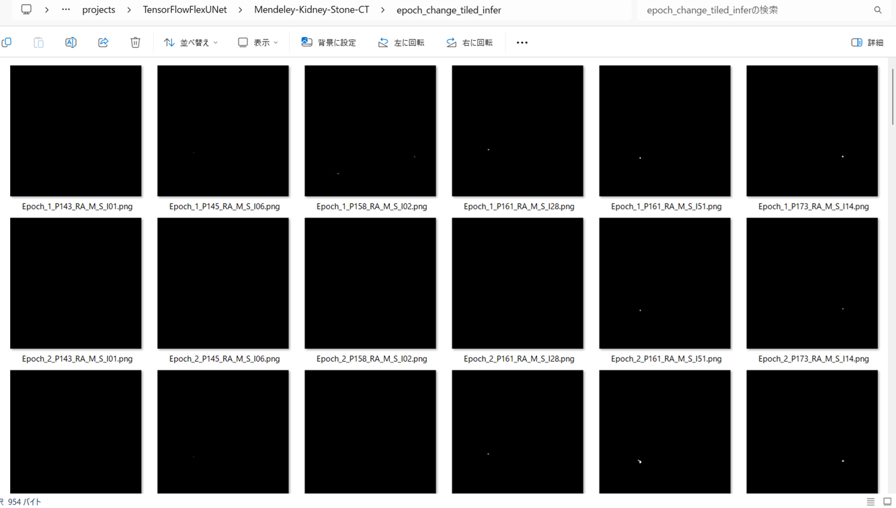 
 
<b>Epoch_change_inference output at ending (9,10,11)</b> 
 
 
<b>Epoch_change_inference output at ending (20,21,22)</b> 
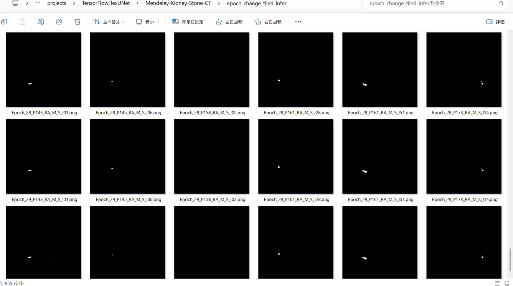 

 
In this experiment, the training process was terminated at epoch 30.  
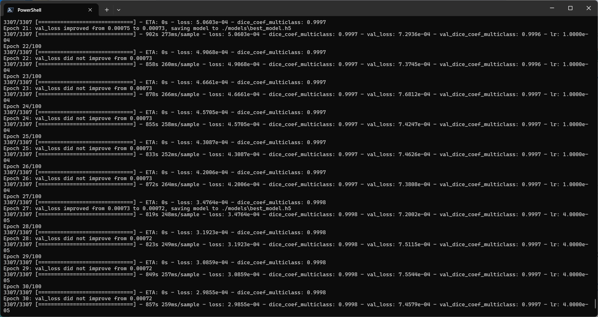 
 
<a href="./projects/TensorFlowFlexUNet/Mendeley-Kidney-Stone-CT/eval/train_metrics.csv">train_metrics.csv</a> 
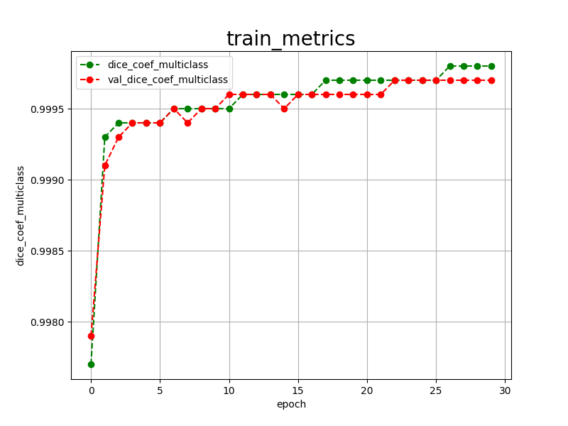 

 
<a href="./projects/TensorFlowFlexUNet/Mendeley-Kidney-Stone-CT/eval/train_losses.csv">train_losses.csv</a> 
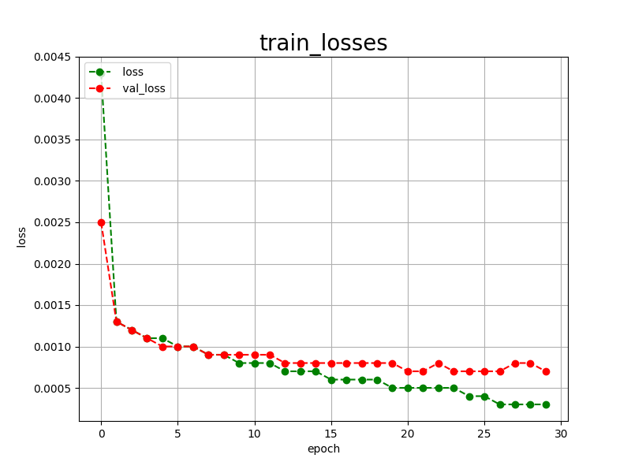 
 
<h3>
4 Evaluation
</h3>
Please move to a <b>./projects/TensorFlowFlexUNet/Mendeley-Kidney-Stone-CT</b> folder, 
and run the following bat file to evaluate TensorflowFlexUNet model for Mendeley-Kidney-Stone-CT. 
<pre>
>./2.evaluate.bat
</pre>
This bat file simply runs the following command.
<pre>
>python ../../../src/TensorFlowFlexUNetEvaluator.py  ./train_eval_infer.config
</pre>
Evaluation console output: 
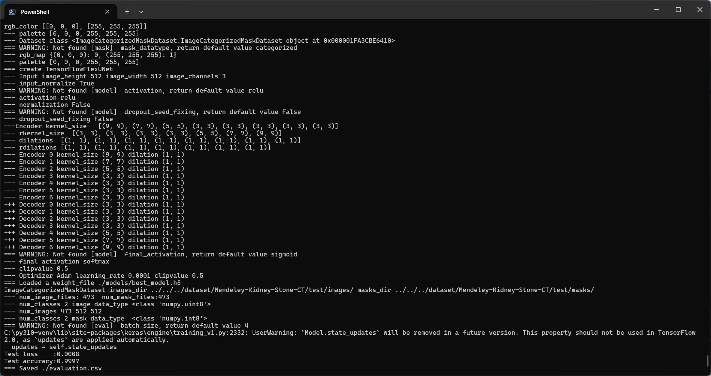
  Image-Segmentation-Mendeley-Kidney-Stone-CT

<a href="./projects/TensorFlowFlexUNet/Mendeley-Kidney-Stone-CT/evaluation.csv">evaluation.csv</a> 
The loss (categorical_crossentropy) to the tiledly split <b>Mendeley-Kidney-Stone-CT/test</b> was very low, and dice_coef_multiclass 
very high as shown below.
 
<pre>
categorical_crossentropy,0.0008
dice_coef_multiclass,0.9997
</pre>
<b>Why was the loss so low and the dice_coef so high in the evaluation scores for the test dataset in this segmentation model? </b> 
The main reason is that the number of black pixels in the Background class is overwhelmingly larger than that of 
white pixels in the Stone class in almost all annotation (mask) data. 
As a result, the Background would be better recognized than the Stone in this multiclass FlexUNet model.
 
<h3>5 Inference</h3>
Please move to a <b>./projects/TensorFlowFlexUNet/Mendeley-Kidney-Stone-CT</b> folder, and run the following bat file to infer segmentation regions for images by the Trained-TensorflowFlexUNet model for Mendeley-Kidney-Stone-CT. 
<pre>
>./3.infer.bat
</pre>
This simply runs the following command.
<pre>
>python ../../../src/TensorFlowFlexUNetInferencer.py ./train_eval_infer.config
</pre>

<b>mini_test_images</b> 
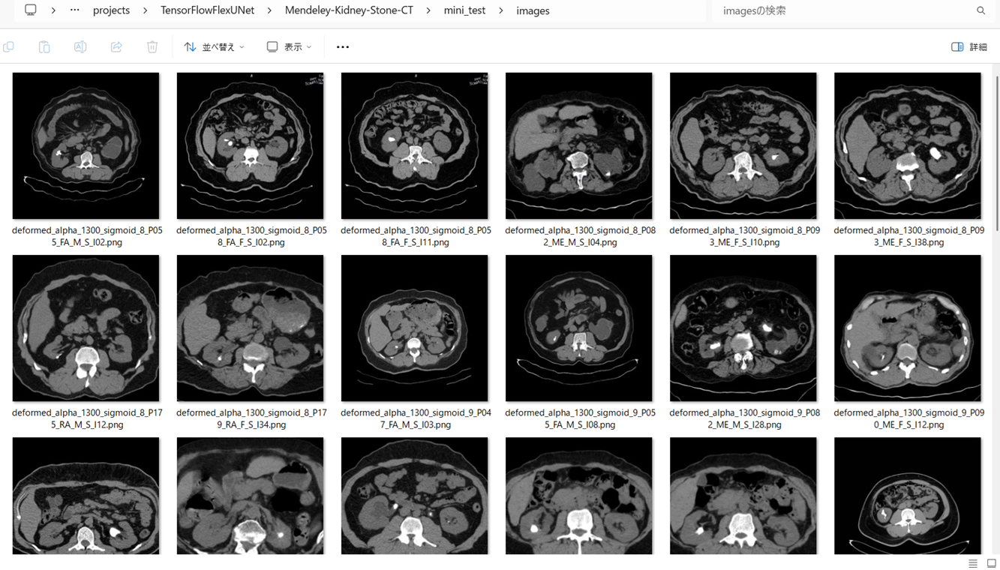 
<b>mini_test_mask(ground_truth)</b> 
 

<b>Inferred test masks</b> 
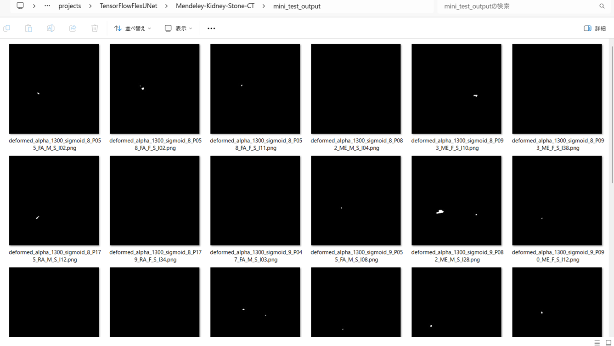 
 

<b>Enlarged images and masks for Mendeley-Kidney-Stone-CT of 512x512 pixels</b> 
As shown below, the inferred masks predicted by our segmentation model trained by the dataset appear similar to the ground truth masks.
 
 
<table>
<tr>
<th>Input: image</th>
<th>Mask (ground_truth)</th>
<th>Prediction: inferred_mask</th>
</tr>
<tr>
<td>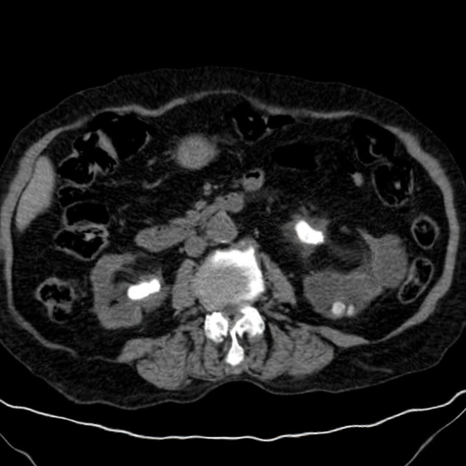</td>
<td></td>
<td></td>
</tr>

<tr>
<td>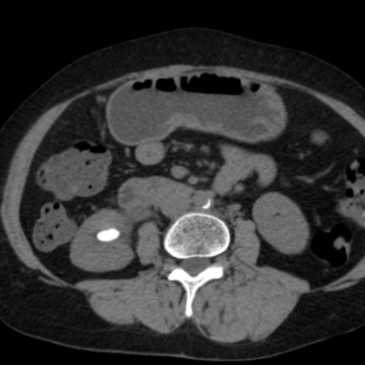</td>
<td></td>
<td></td>
</tr>
<tr>
<td>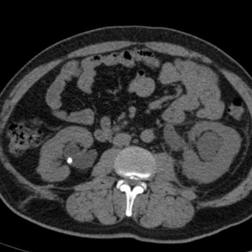</td>
<td></td>
<td></td>
</tr>

<tr>
<td>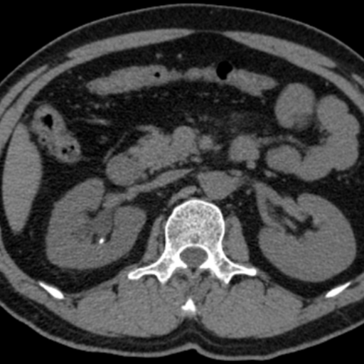</td>
<td></td>
<td></td>
</tr>
<tr>
<td></td>
<td></td>
<td></td>
</tr>
<tr>
<td>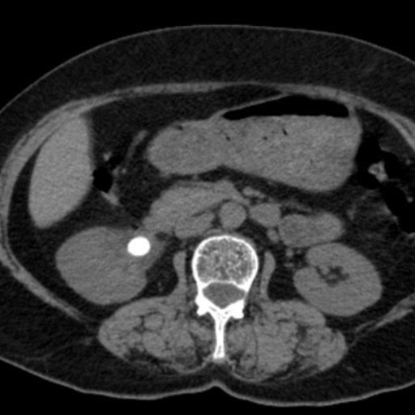</td>
<td></td>
<td>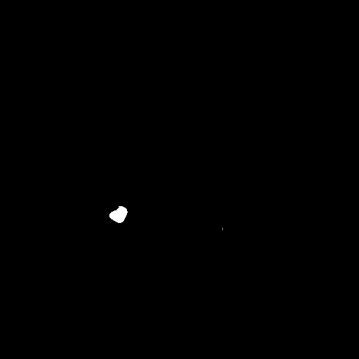</td>
</tr>

</table>

 
<h3>
References
</h3>
<b>1. KSSD2025: A New Annotated Dataset for Automatic Kidney Stone Segmentation and Evaluation With Modified U-Net Based Deep Learning Models</b> 
Murillo F. Murillobouzon; Paulo H. S. de Santana; Gabriel N. Missima; Weverson S. Pereira; Fernando P. Rivera; Gilson A. Giraldi 
<a href="https://ieeexplore.ieee.org/document/11165055">https://ieeexplore.ieee.org/document/11165055</a>
  
<b>2. A deep learning system for automated kidney stone detection and volumetric segmentation on noncontrast CT scans</b> 
Daniel C. Elton, Evrim B.Turkbey, Perry J.Pickhardt, Ronald M.Summers 
<a href="https://www.moreisdifferent.com/assets/my_papers/B_AI_medical_imaging/2022_Z_Elton_Medical_Physics_kidney_stone_detector.pdf">
https://www.moreisdifferent.com/assets/my_papers/B_AI_medical_imaging/2022_Z_Elton_Medical_Physics_kidney_stone_detector.pdf</a>
  
<b>3. TensorFlow-FlexUNet-Image-Segmentation-KSSD2025-Kidney-Stone-CT</b> 
Toshiyuki Arai  
<a href="https://github.com/sarah-antillia/TensorFlow-FlexUNet-Image-Segmentation-KSSD2025-Kidney-Stone-CT">
https://github.com/sarah-antillia/TensorFlow-FlexUNet-Image-Segmentation-KSSD2025-Kidney-Stone-CT
</a>
 
 
<b>4. TensorFlow-FlexUNet-Image-Segmentation-Model</b> 
Toshiyuki Arai  
<a href="https://github.com/sarah-antillia/TensorFlow-FlexUNet-Image-Segmentation-Model">
https://github.com/sarah-antillia/TensorFlow-FlexUNet-Image-Segmentation-Model
</a>
 
 
